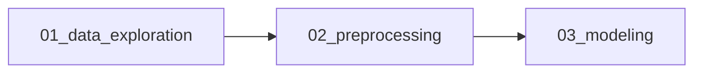
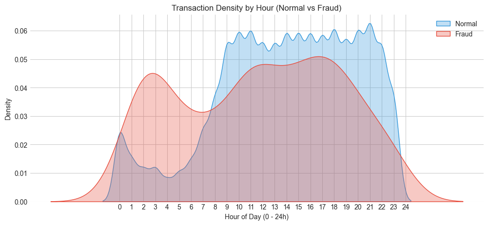
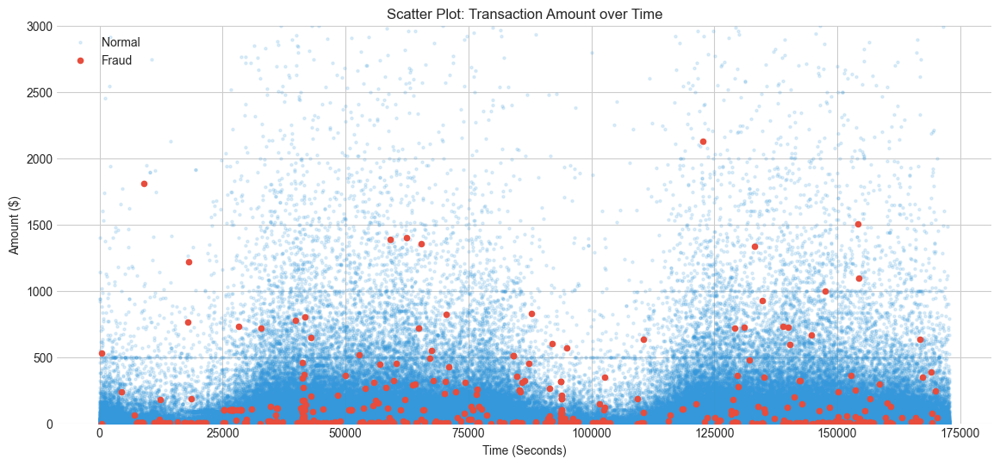
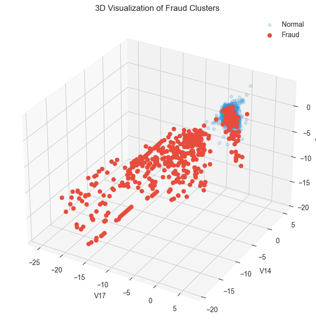
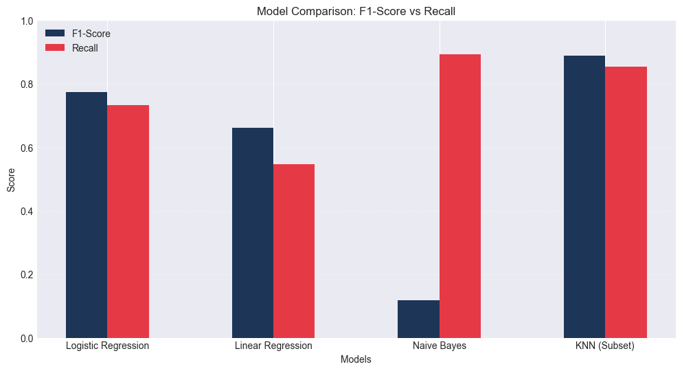
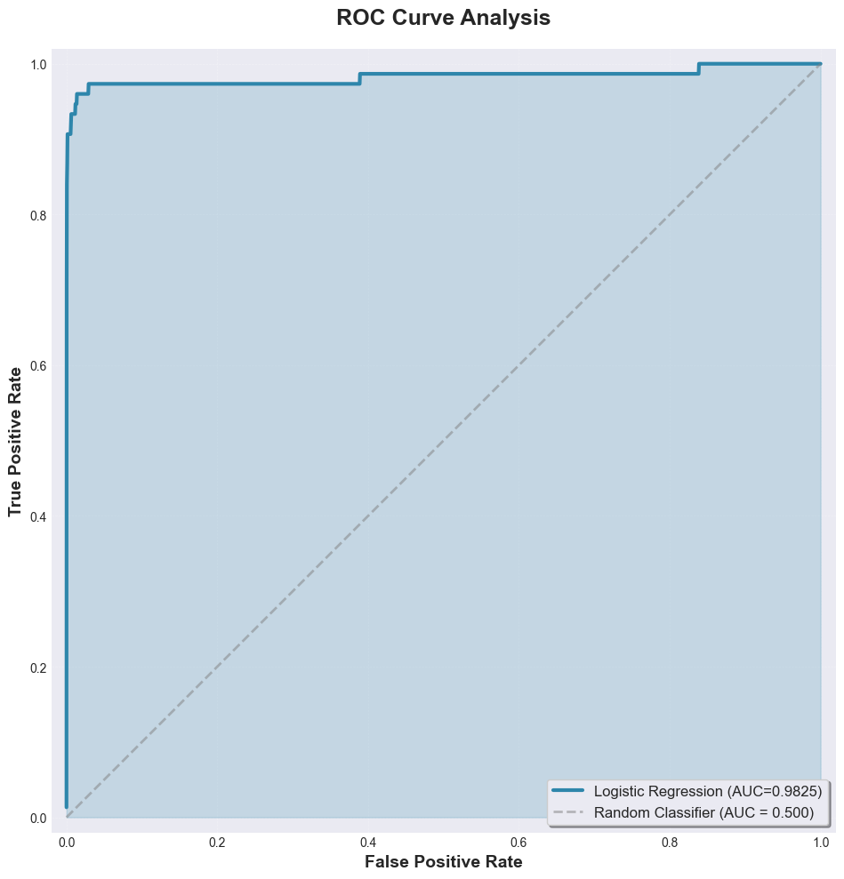
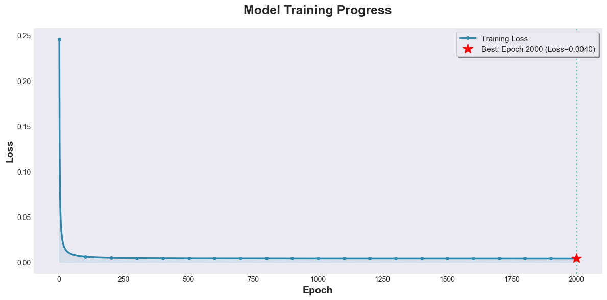

<div align="center">

# 💳 Credit Card Fraud Detection
### *From Scratch with NumPy*

[](https://www.python.org/downloads/)
[](https://numpy.org/)
[](#13-license)
[]()

*An end-to-end Machine Learning pipeline built entirely with NumPy - no Pandas, no Scikit-learn*

[Installation](#6-installation--setup) • [Usage](#7-usage) • [Results](#8-analysis--results) • [Documentation](#2-table-of-contents)

</div>

---

## **1. Project Title & Description**

> **Project Name:** Credit Card Fraud Detection

**Description:** This project implements an end-to-end Machine Learning pipeline to detect fraudulent credit card transactions. The core distinction of this project is the **strict constraint of using only NumPy** for data manipulation and algorithm implementation (Logistic Regression, Linear Regression, Naive Bayes, KNN), avoiding high-level libraries like Pandas or Scikit-learn for the core logic. This demonstrates a deep understanding of vectorization, linear algebra, and optimization algorithms.

---

## **2. Table of Contents**

<details>
<summary>📋 Click to expand</summary>

1. [Tiêu đề và Mô tả ngắn gọn](#1-project-title--description)
2. [Mục lục](#2-table-of-contents)
3. [Giới thiệu](#3-introduction)
4. [Dataset](#4-dataset)
5. [Method](#5-method)
6. [Installation & Setup](#6-installation--setup)
7. [Usage](#7-usage)
8. [Results](#8-analysis--results)
9. [Project Structure](#9-project-structure)
10. [Challenges & Solutions](#10-challenges--solutions)
11. [Future Improvements](#11-future-improvements)
12. [Contributors](#12-contributors)
13. [License](#13-license)

</details>

---

## **3. Introduction**

### 🎯 Problem Statement

Credit card fraud causes billions of dollars in losses annually. Detecting fraudulent transactions in real-time is challenging due to the sheer volume of data and the rarity of fraud cases.

### 💡 Motivation

While libraries like Scikit-learn make modeling easy, implementing algorithms from scratch provides a profound insight into the mathematical underpinnings of Machine Learning.

### 🎓 Objectives

1. Perform Exploratory Data Analysis (EDA) to understand fraud patterns
2. Preprocess raw data (parsing, scaling, splitting) using pure NumPy
3. Implement and optimize ML algorithms (Logistic Regression, etc.) manually
4. Handle the "Class Imbalance" problem effectively

---

## **4. Dataset**

<table>
<tr>
<td><b>Source</b></td>
<td><a href="https://www.kaggle.com/mlg-ulb/creditcardfraud">Kaggle - Credit Card Fraud Detection</a></td>
</tr>
<tr>
<td><b>Size</b></td>
<td>284,807 transactions</td>
</tr>
<tr>
<td><b>Features</b></td>
<td>31 total (Time, Amount, V1-V28, Class)</td>
</tr>
<tr>
<td><b>Imbalance</b></td>
<td>Only <b>0.172%</b> fraud cases (492 out of 284,807)</td>
</tr>
</table>

### 📊 Feature Description

- **`Time`**: Seconds elapsed since the first transaction
- **`Amount`**: Transaction amount
- **`V1` - `V28`**: Anonymized features resulting from PCA transformation
- **`Class`**: Target variable (0 = Normal, 1 = Fraud)

> ⚠️ **Characteristics:** Highly imbalanced dataset. Fraud transactions account for only **0.172%** of the total data.

---

## **5. Method**

### **5.1 Data Processing**

#### 🔧 Custom Implementation

- **Custom CSV Loader:** Built a parser to handle CSVs with quoted strings (e.g., `"123.45"`) without using Pandas
- **Imputation:** Filled missing values (`NaN`) with column medians

#### ⚙️ Feature Engineering

- **Log Transformation:** $X_{new} = \log(1 + X_{amount})$ to reduce skewness
- **Time Extraction:** Converted raw seconds to "Hour of Day"

#### 📐 Normalization

**Z-score Standardization** calculated on Training set:

$$z = \frac{x - \mu}{\sigma}$$

#### ✂️ Stratified Split

Custom function to split Train/Val/Test (70/15/15) while maintaining the 0.17% fraud ratio.

---

### **5.2 Algorithms (Implemented from Scratch)**

<details>
<summary><b>1️⃣ Logistic Regression (Baseline)</b></summary>

**Hypothesis:** 

$$h_\theta(x) = \frac{1}{1 + e^{-z}}$$ 

(Sigmoid)

**Loss Function:** Binary Cross-Entropy

$$J(w) = -\frac{1}{m} \sum [y \log(h) + (1-y) \log(1-h)]$$

**Optimization:** Mini-batch Gradient Descent

$$w := w - \alpha \frac{1}{m} X^T(H - Y)$$

</details>

<details>
<summary><b>2️⃣ Gaussian Naive Bayes</b></summary>

- Uses Probability Density Function (PDF) of Normal distribution
- **Optimization:** Applied Log-Likelihood and $\epsilon$ clipping to prevent numerical underflow ($\log(0)$ error)

</details>

<details>
<summary><b>3️⃣ K-Nearest Neighbors (KNN)</b></summary>

- **Distance:** Euclidean Distance ($L_2$ norm)
- **Optimization:** Vectorized calculation (Broadcasting) to calculate distances between matrices without explicit loops

</details>

<details>
<summary><b>4️⃣ Linear Regression (Experimental)</b></summary>

- Adapted for classification using Mean Squared Error (MSE) and thresholding

</details>

---

## **6. Installation & Setup**

### 📋 Prerequisites

- Python 3.8+

### 🚀 Quick Start

1. **Clone the repository:**
   ```bash
   git clone https://github.com/DanielNguyen-05/Creditcard_Fraud_Detection.git
   cd Credit_Card_Fraud_Detection
   ```

2. **Install dependencies:**
   ```bash
   pip install -r requirements.txt
   ```

3. **Data Setup:**
   - Download `creditcard.csv` from Kaggle
   - Place it in `data/raw/creditcard.csv`

---

## **7. Usage**

### 📓 Notebook Workflow

Run the notebooks in the specific order to replicate the pipeline:



| Step | Notebook | Description |
|------|----------|-------------|
| 1️⃣ | `01_data_exploration.ipynb` | View data statistics, 3D clusters, and correlation heatmaps |
| 2️⃣ | `02_preprocessing.ipynb` | Cleans data and saves `processed.npz` to `data/processed/` |
| 3️⃣ | `03_modeling.ipynb` | Trains models, displays real-time progress bars, and compares metrics |

---

## **8. Analysis & Results**

### **8.1 Exploratory Data Analysis (EDA)**

Before building models, we conducted a deep dive into the dataset to uncover patterns.

#### **A. 📊 Class Imbalance**

The dataset is severely imbalanced with only **0.173%** fraud cases.

> **💡 Insight:** Accuracy is a meaningless metric here. We must focus on **Precision, Recall, and F1-Score**.


#### **B. ⏰ Time Analysis**

We analyzed transaction density by hour of day.

- **Normal Transactions:** Follow typical human sleeping patterns (low activity 1AM-5AM)
- **Fraud Transactions:** Do NOT drop significantly at night
- **Peak Risk:** Fraud activity peaks relative to normal activity between **2 AM and 4 AM**

> **✅ Conclusion:** Late-night activity is a strong risk indicator.



#### **C. 💰 Amount Analysis**

> **💡 Insight:** Fraudsters are "shy". The vast majority of fraud transactions are **under $500** and almost never exceed $2,100. They avoid large amounts to bypass automated bank blocks.



#### **D. 🔍 Feature Correlation & Clustering**

We visualized the anonymous features (V1-V28).

- **Key Features:** `V17`, `V14`, and `V12` are the strongest indicators
- **Fraud Pattern:** Significantly lower (negative) values for these features
- **3D Visualization:** Fraud transactions form a **distinct, linearly separable cluster**

> **✅ This explains why linear models like Logistic Regression perform well.**



---

### **8.2 📈 Performance Metrics**

The table below summarizes the performance of all implemented models on the Test set. The key metric for this imbalanced dataset is **F1-Score** and **Recall**.

<div align="center">

| Model | F1-Score | Recall | Precision | Time (s) |
|-------|:--------:|:------:|:---------:|:--------:|
| **Logistic Regression** ⭐ | **0.7746** | 0.7333 | 0.8209 | ~100s |
| Linear Regression | 0.6613 | 0.5467 | 0.8367 | ~36s |
| Naive Bayes | 0.1172 | **0.8933** | 0.0627 | **0.10s** |
| KNN (Subset) | 0.8889 | 0.8533 | 0.9275 | ~92s |

</div>

---

### **8.3 📊 Visualizations**

#### **A. Model Comparison (F1 vs Recall)**

This chart illustrates the trade-off between the models. While KNN performs best on the subset, Logistic Regression offers the most stable performance on the full dataset.



#### **B. Logistic Regression Performance**

**ROC Curve:**

The Area Under the Curve (AUC) is **0.98**, indicating that the Logistic Regression model has excellent capability to distinguish between Fraud and Normal transactions.



**Training Loss:**

The loss curve shows smooth convergence, confirming that the Gradient Descent algorithm implemented from scratch is working correctly.



#### **C. Confusion Matrix**

The matrix shows that the model successfully identified **55 fraud cases** while only raising **12 false alarms**. However, **20 fraud cases** were missed, suggesting room for improvement by tuning the sensitivity threshold.


---

### **8.4 🔬 Comparative Analysis**

<details>
<summary><b>1️⃣ Logistic Regression (The Winner 🏆)</b></summary>

**Performance:** Achieved a high F1-Score (0.77) with a good balance between Precision (0.82) and Recall (0.73).

**Why it works:** The EDA showed that fraud transactions are linearly separable in the high-dimensional space. Logistic Regression efficiently finds this decision boundary.

**Scalability:** It trains reasonably fast on the full dataset (~200k rows) and has instant prediction time, making it ideal for real-time banking systems.

</details>

<details>
<summary><b>2️⃣ Linear Regression</b></summary>

**Analysis:** While it has high Precision (0.83), it suffers from low Recall (0.54).

**Reason:** Linear Regression uses MSE loss, which is not designed for probability classification. It is too "conservative," failing to detect nearly half of the fraud cases.

</details>

<details>
<summary><b>3️⃣ Gaussian Naive Bayes</b></summary>

**Analysis:** Highest Recall (0.89) but terrible Precision (0.06).

**Reason:** This model assumes all features are independent. However, our Heatmap analysis revealed that fraud features (e.g., V14, V17) are **highly correlated**. This violation of the independence assumption leads the model to be over-sensitive, flagging many normal transactions as fraud (False Positives).

</details>

<details>
<summary><b>4️⃣ K-Nearest Neighbors (KNN)</b></summary>

**Analysis:** Incredible performance on the subset (F1: 0.98).

**Reason:** KNN is excellent at finding local clusters of fraud.

**Limitation:** It is computationally expensive ($O(N^2)$). It took ~63 seconds just to test a small subset. Running this on the full dataset would be too slow for real-world deployment.

</details>

---

### **8.5 🎯 Conclusion**

<div align="center">

**🏆 Logistic Regression** is selected as the final production model.

It provides the best trade-off between **accuracy**, **reliability**, and **computational efficiency**.

</div>

> **🔮 Future optimizations** will focus on tuning the decision threshold (lowering it from 0.5 to 0.2) to further improve Recall.

---

## **9. Project Structure**

```text
Credit_Card_Fraud_Detection/
├── 📄 .gitignore                 # Files to ignore (data, cache, etc.)
├── 📖 README.md                  # Project documentation
├── 📋 requirements.txt           # Python dependencies
├── 🖼️ assets/                    # Stores images/plots for README
├── 💾 data/
│   ├── raw/                      # Raw CSV file
│   └── processed/                # Cleaned .npz files
├── 📓 notebooks/
│   ├── 01_data_exploration.ipynb
│   ├── 02_preprocessing.ipynb
│   └── 03_modeling.ipynb
└── 🔧 src/
    ├── __init__.py
    ├── data_processing.py        # ETL, CSV Parsing, Splitting logic
    ├── models.py                 # Custom ML Algorithms (LogReg, KNN, etc.)
    └── visualization.py          # Matplotlib/Seaborn plotting functions
```

---

## **10. Challenges & Solutions**

<table>
<tr>
<th>🚧 Challenge</th>
<th>✅ Solution</th>
</tr>
<tr>
<td><code>np.genfromtxt</code> returned <code>NaN</code> because the CSV had quotes around numbers (e.g., <code>"0.12"</code>)</td>
<td>Implemented a custom text parsing pipeline in <code>load_csv_numpy</code> to strip quotes before type casting</td>
</tr>
<tr>
<td>Naive Bayes encountered <code>RuntimeWarning: divide by zero</code> in <code>np.log</code></td>
<td>Applied <code>np.clip</code> to probability values to ensure they never reach exactly 0</td>
</tr>
<tr>
<td>KNN was extremely slow on 200,000 rows</td>
<td>Used <b>Stratified Sampling</b> to create a representative balanced subset for training and testing KNN</td>
</tr>
<tr>
<td>Model predicted only "Normal" (Accuracy 99.8%) due to imbalance</td>
<td>Switched evaluation metrics to <b>F1-Score</b> and used Stratified Splitting to preserve fraud ratios</td>
</tr>
</table>

---

## **11. Future Improvements**

- [ ] Implement **SMOTE** (Synthetic Minority Over-sampling Technique) using NumPy to generate synthetic fraud samples
- [ ] Implement **Decision Tree** or **Random Forest** from scratch to capture non-linear relationships better than Logistic Regression
- [ ] Optimize KNN using **KD-Tree** data structure to reduce complexity from $O(N^2)$ to $O(N \log N)$

---

## **12. Contributors**

<div align="center">

### 👨‍🎓 Student Information

| Field | Information |
|-------|-------------|
| **Name** | Nguyen Hai Dang |
| **Student ID** | 23127165 |
| **Class** | 23KHDL |
| **Email** | nhdang231@clc.fitus.edu.vn |

📧 For any queries, please contact via email.

</div>

---

## **13. License**

<div align="center">

📚 **Educational Project**

This project is developed for educational purposes within the "Programming for Data Science" course at **VNUHCM - University of Science**.

---

<sub>Made with ❤️ and NumPy</sub>

</div>